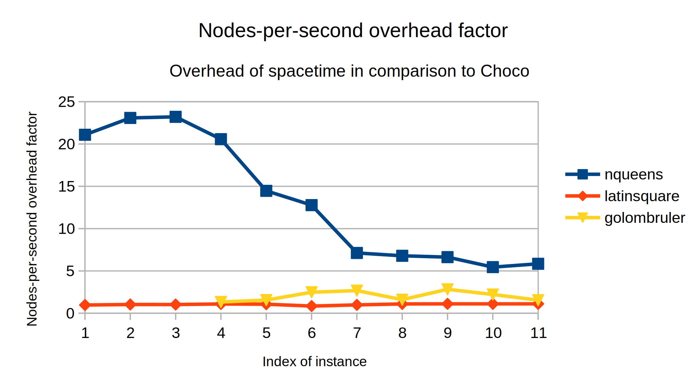

# Benchmark of the language

This supplementary page completes the evaluation of spacetime presented in the paper.
It also gives instructions to compile the examples presented in the paper.

If you want to replicate any benchmark and running examples, please go through the [Getting Started](getting-started.html) section first.

## Evaluation

### Methodology

We evaluate spacetime on three examples programmed in spacetime and in the constraint solver Choco.

1. [Latin Square](https://en.wikipedia.org/wiki/Latin_square): Find the first solution of 11 instances where the size of the square ranges from 30 to 80.
2. [Golomb Ruler](https://en.wikipedia.org/wiki/Golomb_ruler): Find the optimal solution of 8 instances where the length of the ruler ranges from 4 to 11.
3. [NQueens](https://en.wikipedia.org/wiki/Nqueens): Find all solutions of 11 instances where the size of the chess board ranges from 4 to 14.

Each instance is executed a first time to warm up the JVM, and then 10 times in a row.
The solving time of this instance is the median of these 10 runs.
The other statistics such as the number of nodes processed per second are identical between two runs.
The results are automatically printed in a CSV format.

### Analysis of the results

The results are available in [this file](https://github.com/ptal/bonsai/blob/master/benchmark/data/benches.csv) and also at the end of this page.

The three constraint models are particularly interesting because they test different aspects of solving:

1. Latin Square is _propagation intensive_ since it finds the solution without backtracking and for all size of instances tested.
2. Golomb ruler tests the branch-and-bound algorithm in order to optimize a value, it is a mix between propagation and search.
3. NQueens is _search intensive_ since it searches for all the solutions.

We summarize these results in the following three charts.





The results indicate, as expected, that the overhead is greater for search intensive problems such as NQueens.
The reason is that we explore more nodes, hence we spend more time in the spacetime abstraction to perform search.
The Latin square problem shows that without backtracking spacetime is in par with Choco.
Finally, the Golomb ruler problem demonstrates that Choco has a more efficient BAB strategy since it explores less nodes.

Overall, we observe that the number of nodes processed per second (n/s) in spacetime stabilized around 35.000 n/s for larger instances.
In NQueens, the overhead compared to Choco is about a factor 6.
Surprisingly, the number of nodes processed per second in Choco drops of about 25% when the instance size increase (in NQueens), whereas it stays stable in spacetime.

As for correctness, spacetime always find the same number of solutions as Choco, and the same lower bound for optimization problems (Golomb ruler).

### How to run the benchmark

First install spacetime by following the instructions in [Getting Started](getting-started.html).
Then you can simply type:

```sh
cd benchmark
# The "2> /dev/null" is to prevent Choco to print logging messages.
./run.sh 2> /dev/null
```

The file [Benchmark.java](https://github.com/ptal/bonsai/blob/master/benchmark/src/main/java/benchmark/Benchmark.java) contains some parameters that can be tweaked such as the size of the instances and the number of trials for each instance.

## Tests

The compiler and runtime of spacetime are well tested, you can run the tests of the compiler with:

```sh
cargo test
cd runtime
mvn test
```

There are about 200 tests, ranging from the static analysis of the compiler ([compile-fail](https://github.com/ptal/bonsai/tree/master/data/test/compile-fail) and [compile-pass](https://github.com/ptal/bonsai/tree/master/data/test/compile-pass)) as well as the runtime behavior ([run-pass](https://github.com/ptal/bonsai/tree/master/data/test/run-pass)) to the correctness of the lattice library.

## Examples

Examples are provided in the [standard library](https://github.com/ptal/bonsai/tree/master/libstd/src/main/java/bonsai) of spacetime.
The [benchmark problems](https://github.com/ptal/bonsai/blob/master/benchmark/src/main/java/benchmark/bonsai/LatinSquare.bonsai.java) rely on this standard library.

To explore a simple example, have a look at the [HelloWorld](https://github.com/ptal/bonsai/tree/master/examples/bonsai/HelloWorld) folder.
It can be run with the following commands:

```sh
cd examples/bonsai/HelloWorld
./run.sh
```

## Results of experiments

| problems             | size | nodes   | solutions | fails   | time(timeout=1080s)          | nodes per seconds | obj |
| -------------------- | ---- | ------- | --------- | ------- | ---------------------------- | ----------------- | --- |
| NQueens              | 4    | 11      | 2         | 4       | 4315082(4ms)(0s)             | 2549n/s           | na  |
| NQueens              | 5    | 27      | 10        | 4       | 5436722(5ms)(0s)             | 4966n/s           | na  |
| NQueens              | 6    | 71      | 4         | 32      | 12060357(12ms)(0s)           | 5887n/s           | na  |
| NQueens              | 7    | 207     | 40        | 64      | 19239670(19ms)(0s)           | 10759n/s          | na  |
| NQueens              | 8    | 723     | 92        | 270     | 41507869(41ms)(0s)           | 17418n/s          | na  |
| NQueens              | 9    | 2701    | 352       | 999     | 134018818(134ms)(0s)         | 20153n/s          | na  |
| NQueens              | 10   | 10343   | 724       | 4448    | 288574479(288ms)(0s)         | 35841n/s          | na  |
| NQueens              | 11   | 44327   | 2680      | 19484   | 1234262063(1234ms)(1s)       | 35913n/s          | na  |
| NQueens              | 12   | 209051  | 14200     | 90326   | 6033862755(6033ms)(6s)       | 34646n/s          | na  |
| NQueens              | 13   | 1053345 | 73712     | 452961  | 31593087031(31593ms)(31s)    | 33340n/s          | na  |
| NQueens              | 14   | 5689301 | 365596    | 2479055 | 177211833093(177211ms)(177s) | 32104n/s          | na  |
| NQueensChoco         | 4    | 11      | 2         | 4       | 204633(0ms)(0s)              | 53754n/s          | na  |
| NQueensChoco         | 5    | 27      | 10        | 4       | 235566(0ms)(0s)              | 114617n/s         | na  |
| NQueensChoco         | 6    | 71      | 4         | 32      | 519718(0ms)(0s)              | 136612n/s         | na  |
| NQueensChoco         | 7    | 207     | 40        | 64      | 935391(0ms)(0s)              | 221297n/s         | na  |
| NQueensChoco         | 8    | 723     | 92        | 270     | 2870142(2ms)(0s)             | 251903n/s         | na  |
| NQueensChoco         | 9    | 2681    | 352       | 989     | 10414608(10ms)(0s)           | 257426n/s         | na  |
| NQueensChoco         | 10   | 10223   | 724       | 4388    | 40039151(40ms)(0s)           | 255325n/s         | na  |
| NQueensChoco         | 11   | 43723   | 2680      | 19182   | 179399336(179ms)(0s)         | 243718n/s         | na  |
| NQueensChoco         | 12   | 205819  | 14200     | 88710   | 896483444(896ms)(0s)         | 229584n/s         | na  |
| NQueensChoco         | 13   | 1035143 | 73712     | 443860  | 5694564313(5694ms)(5s)       | 181777n/s         | na  |
| NQueensChoco         | 14   | 5579051 | 365596    | 2423930 | 29763594814(29763ms)(29s)    | 187445n/s         | na  |
| LatinSquare          | 30   | 685     | 1         | 0       | 601579096(601ms)(0s)         | 1138n/s           | na  |
| LatinSquare          | 35   | 902     | 1         | 0       | 1371971201(1371ms)(1s)       | 657n/s            | na  |
| LatinSquare          | 40   | 1223    | 1         | 0       | 2574607016(2574ms)(2s)       | 475n/s            | na  |
| LatinSquare          | 45   | 1550    | 1         | 0       | 4973909990(4973ms)(4s)       | 311n/s            | na  |
| LatinSquare          | 50   | 1979    | 1         | 0       | 8382301179(8382ms)(8s)       | 236n/s            | na  |
| LatinSquare          | 55   | 2370    | 1         | 0       | 12266404153(12266ms)(12s)    | 193n/s            | na  |
| LatinSquare          | 60   | 2953    | 1         | 0       | 19276435692(19276ms)(19s)    | 153n/s            | na  |
| LatinSquare          | 65   | 3403    | 1         | 0       | 33301966542(33301ms)(33s)    | 102n/s            | na  |
| LatinSquare          | 70   | 3929    | 1         | 0       | 48180524734(48180ms)(48s)    | 81n/s             | na  |
| LatinSquare          | 75   | 4481    | 1         | 0       | 68495985452(68495ms)(68s)    | 65n/s             | na  |
| LatinSquare          | 80   | 5267    | 1         | 0       | 94365742593(94365ms)(94s)    | 55n/s             | na  |
| LatinSquareChoco     | 30   | 685     | 1         | 0       | 621461014(621ms)(0s)         | 1102n/s           | na  |
| LatinSquareChoco     | 35   | 902     | 1         | 0       | 1330421168(1330ms)(1s)       | 677n/s            | na  |
| LatinSquareChoco     | 40   | 1223    | 1         | 0       | 2503450986(2503ms)(2s)       | 488n/s            | na  |
| LatinSquareChoco     | 45   | 1550    | 1         | 0       | 4557103940(4557ms)(4s)       | 340n/s            | na  |
| LatinSquareChoco     | 50   | 1979    | 1         | 0       | 7829274683(7829ms)(7s)       | 252n/s            | na  |
| LatinSquareChoco     | 55   | 2370    | 1         | 0       | 14454058294(14454ms)(14s)    | 163n/s            | na  |
| LatinSquareChoco     | 60   | 2953    | 1         | 0       | 19469066122(19469ms)(19s)    | 151n/s            | na  |
| LatinSquareChoco     | 65   | 3403    | 1         | 0       | 30288080613(30288ms)(30s)    | 112n/s            | na  |
| LatinSquareChoco     | 70   | 3929    | 1         | 0       | 43307048274(43307ms)(43s)    | 90n/s             | na  |
| LatinSquareChoco     | 75   | 4481    | 1         | 0       | 62123523848(62123ms)(62s)    | 72n/s             | na  |
| LatinSquareChoco     | 80   | 5267    | 1         | 0       | 85653803458(85653ms)(85s)    | 61n/s             | na  |
| GolombRulerIOLB      | 4    | 9       | 3         | 2       | 1277767(1ms)(0s)             | 7043n/s           | 6   |
| GolombRulerIOLB      | 5    | 19      | 3         | 7       | 2239983(2ms)(0s)             | 8482n/s           | 11  |
| GolombRulerIOLB      | 6    | 47      | 4         | 20      | 4461597(4ms)(0s)             | 10534n/s          | 17  |
| GolombRulerIOLB      | 7    | 487     | 5         | 239     | 36040899(36ms)(0s)           | 13512n/s          | 25  |
| GolombRulerIOLB      | 8    | 3705    | 8         | 1845    | 185321829(185ms)(0s)         | 19992n/s          | 34  |
| GolombRulerIOLB      | 9    | 31127   | 11        | 15553   | 1647811861(1647ms)(1s)       | 18889n/s          | 44  |
| GolombRulerIOLB      | 10   | 238219  | 11        | 119099  | 13422315277(13422ms)(13s)    | 17747n/s          | 55  |
| GolombRulerIOLB      | 11   | 4389807 | 16        | 2194888 | 277510878623(277510ms)(277s) | 15818n/s          | 72  |
| GolombRulerChocoIOLB | 4    | 7       | 2         | 2       | 747536(0ms)(0s)              | 9364n/s           | 6   |
| GolombRulerChocoIOLB | 5    | 11      | 2         | 4       | 833751(0ms)(0s)              | 13193n/s          | 11  |
| GolombRulerChocoIOLB | 6    | 29      | 3         | 12      | 1109435(1ms)(0s)             | 26139n/s          | 17  |
| GolombRulerChocoIOLB | 7    | 167     | 4         | 80      | 4625705(4ms)(0s)             | 36102n/s          | 25  |
| GolombRulerChocoIOLB | 8    | 981     | 7         | 484     | 30585592(30ms)(0s)           | 32073n/s          | 34  |
| GolombRulerChocoIOLB | 9    | 5041    | 10        | 2511    | 94337582(94ms)(0s)           | 53435n/s          | 44  |
| GolombRulerChocoIOLB | 10   | 31943   | 10        | 15962   | 813255733(813ms)(0s)         | 39277n/s          | 55  |
| GolombRulerChocoIOLB | 11   | 569303  | 15        | 284637  | 23262703536(23262ms)(23s)    | 24472n/s          | 72  |
|                      |
